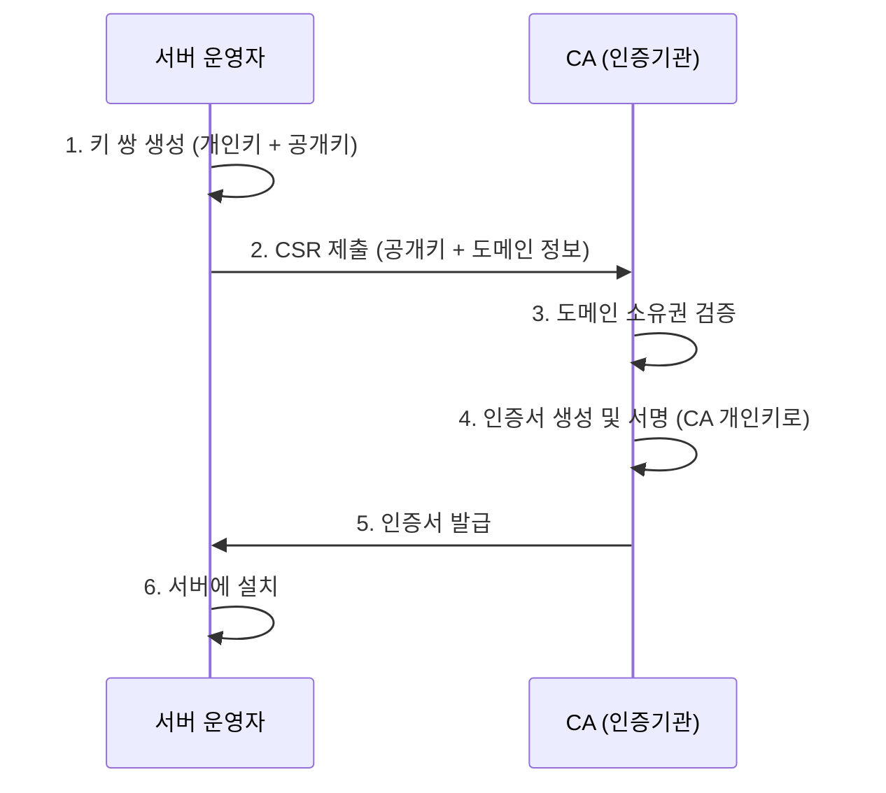

# 인증서 발급 과정

## 전체 흐름



## 1단계: 키 쌍 생성

서버 운영자가 RSA 또는 ECDSA 키 쌍을 생성한다.

```bash
# RSA 2048bit 키 생성
openssl genrsa -out server.key 2048
```

- **개인키** (server.key) - 서버만 보유, 유출 금지
- **공개키** - CSR에 포함되어 CA에 전달

## 2단계: CSR (Certificate Signing Request) 생성

```bash
openssl req -new -key server.key -out server.csr
```

CSR에 포함되는 정보:
- 공개키
- 도메인 (CN: Common Name)
- 조직 정보 (선택)
- 서버 운영자의 개인키로 서명 (본인 확인용)

## 3단계: 도메인 소유권 검증 (DV 인증서 기준)

CA가 도메인 소유권을 확인하는 방법:
- **DNS 검증** - 특정 TXT 레코드 추가
- **HTTP 검증** - 특정 경로에 파일 업로드
- **이메일 검증** - admin@도메인 으로 확인 메일

## 4단계: 인증서 생성 및 서명

CA가 수행하는 작업:

```
[tbsCertificate 생성]
┌─────────────────────────────────┐
│ version: v3                     │
│ serialNumber: (CA가 생성)        │
│ issuer: CN=Sectigo...           │  ← CA 자신의 정보
│ validity: 2025-11-14 ~ 2026-12-13│
│ subject: CN=*.daouoffice.com    │  ← CSR에서 가져옴
│ publicKey: (CSR에서 가져옴)       │
│ extensions: ...                 │
└─────────────────────────────────┘
              ↓
         Hash (SHA256)
              ↓
         해시값
              ↓
    CA 개인키로 암호화 (RSA)
              ↓
┌─────────────────────────────────┐
│ signatureValue                  │
└─────────────────────────────────┘
```

최종 인증서 구조:
```
Certificate = tbsCertificate + signatureAlgorithm + signatureValue
```

## 5단계: 인증서 발급

CA가 서명된 인증서를 PEM 형식으로 전달:
```
-----BEGIN CERTIFICATE-----
MIIGXzCCBUegAwIBAgIQ...
-----END CERTIFICATE-----
```

## 6단계: 서버에 설치

```
서버 설정:
- 개인키: server.key (1단계에서 생성)
- 인증서: server.crt (CA에서 발급)
- 체인: chain.crt (중간 CA 인증서)
```

## 서명의 의미

```
CA 개인키로 서명 → "이 인증서는 내가 발급한 것이 맞다"
                   (CA만 개인키를 가지고 있으므로)

CA 공개키로 검증 → "이 서명은 진짜 CA가 한 것이다"
                   (공개키는 누구나 가지고 있음)
```

## 신뢰 체인

```
서버 인증서 ← 중간 CA 개인키로 서명
     ↓
중간 CA 인증서 ← 루트 CA 개인키로 서명
     ↓
루트 CA 인증서 ← 자체 서명 (브라우저/OS에 내장)
```