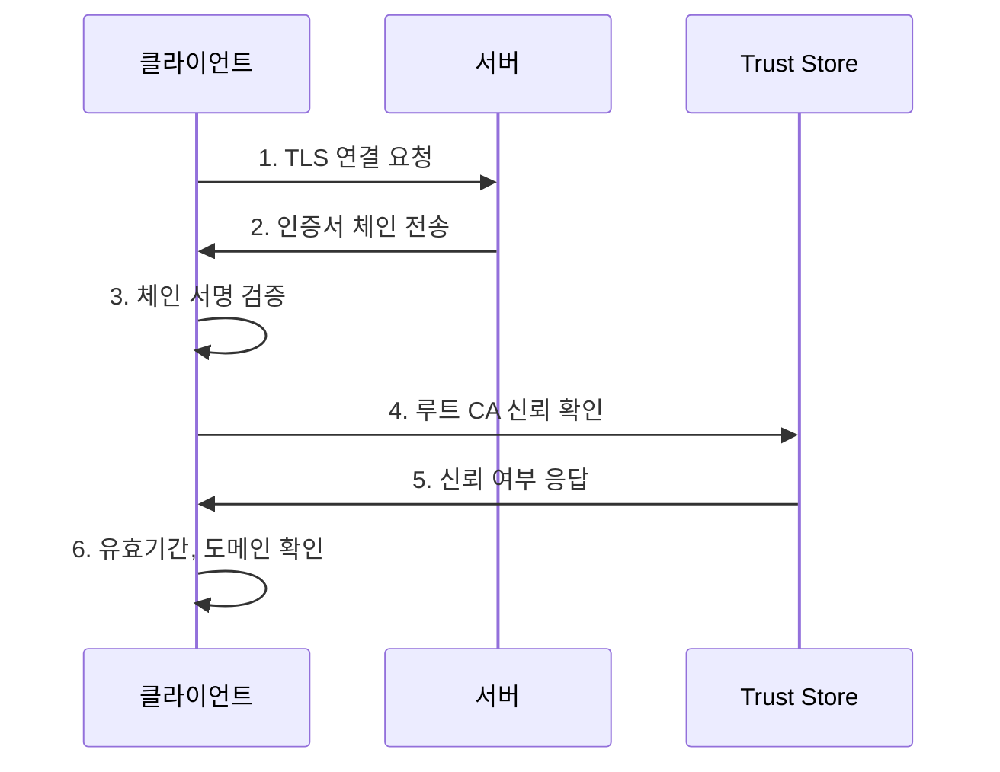

# 인증서 검증 과정

## 전체 흐름



## 1단계: 인증서 체인 수신

서버가 인증서 체인을 전송한다.

```
[인증서 0] *.daouoffice.com      ← 서버 인증서
[인증서 1] Sectigo RSA...        ← 중간 CA
[인증서 2] USERTrust RSA...      ← 루트 CA
```

## 2단계: 체인 서명 검증

각 인증서의 서명을 상위 CA의 공개키로 검증한다.

```
[서버 인증서]
     │
     │  tbsCertificate → Hash(SHA256) → 해시값
     │                                     ↓
     │                              비교 ← 서명값을 중간 CA 공개키로 복호화
     ↓
[중간 CA 인증서]
     │
     │  tbsCertificate → Hash(SHA384) → 해시값
     │                                     ↓
     │                              비교 ← 서명값을 루트 CA 공개키로 복호화
     ↓
[루트 CA 인증서]
     │
     └─ 자체 서명 (Subject = Issuer)
```

**Java 코드**
```java
// 서버 인증서를 중간 CA 공개키로 검증
serverCert.verify(intermediateCert.getPublicKey());

// 중간 CA 인증서를 루트 CA 공개키로 검증
intermediateCert.verify(rootCert.getPublicKey());

// 루트 CA 자체 서명 검증
rootCert.verify(rootCert.getPublicKey());
```

## 3단계: 루트 CA 신뢰 확인

루트 CA가 시스템 Trust Store에 있는지 확인한다.

**Trust Store 위치**
- Java: `$JAVA_HOME/lib/security/cacerts`
- macOS: `/System/Library/Keychains/`
- Windows: `certmgr.msc`

**Java 코드**
```java
KeyStore trustStore = KeyStore.getInstance("JKS");
trustStore.load(new FileInputStream(cacertsPath), "changeit".toCharArray());

Enumeration<String> aliases = trustStore.aliases();
while (aliases.hasMoreElements()) {
    String alias = aliases.nextElement();
    X509Certificate trustedCert = (X509Certificate) trustStore.getCertificate(alias);

    if (trustedCert.getSubjectX500Principal().equals(rootCert.getSubjectX500Principal())) {
        // 신뢰할 수 있는 CA
    }
}
```

## 4단계: 추가 검증 (선택)

| 검증 항목 | 확인 내용 |
|----------|----------|
| 유효기간 | `cert.getNotBefore()`, `cert.getNotAfter()` |
| 도메인 일치 | Subject의 CN 또는 SAN 확인 |
| 폐기 여부 | CRL 또는 OCSP로 확인 |
| 키 용도 | Key Usage 확장 필드 확인 |

## 검증 실패 사례

| 실패 유형 | 원인 |
|----------|------|
| 서명 검증 실패 | 인증서가 변조됨 |
| 루트 CA 없음 | 알 수 없는 CA가 발급 |
| 만료됨 | 유효기간 지남 |
| 도메인 불일치 | 다른 도메인용 인증서 |